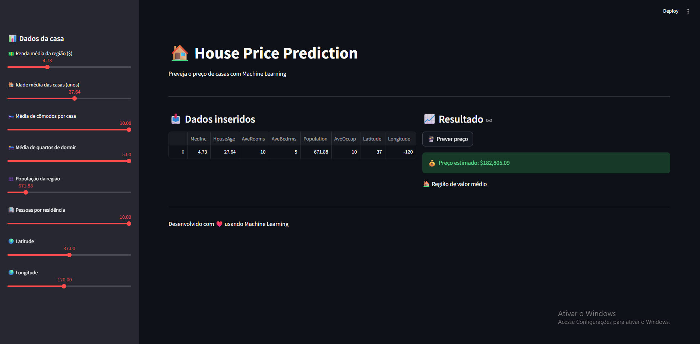

# 🏠 House Price Prediction

Projeto de Machine Learning para previsão de preços de casas com base no dataset California Housing.



## 📌 Sobre o projeto

Este projeto implementa um pipeline completo de ML com:

- análise exploratória dos dados;
- treinamento de modelos;
- avaliação com métricas de regressão;
- persistência de modelo treinado;
- aplicação web interativa com Streamlit.

## 🚀 Tecnologias

- Python
- Pandas
- NumPy
- Scikit-learn
- Matplotlib
- Streamlit
- Joblib

## 🤖 Modelos treinados

- Regressão Linear
- Random Forest Regressor

Treinamento centralizado em [`model.train_models`](src/model.py), no arquivo [src/model.py](src/model.py).

## 📈 Métricas avaliadas

- MAE (Mean Absolute Error)
- MSE (Mean Squared Error)
- RMSE (Root Mean Squared Error)
- $R^2$ Score

## 📁 Estrutura do projeto

```text
.
├── .gitignore
├── README.md
├── requirements.txt
├── data/
├── models/
│   └── model.pkl
├── notebook/
└── src/
    ├── app.py
    ├── model.py
    ├── predict.py
    └── train.py
```

## ⚙️ Como executar

### 1) Clonar o repositório

```bash
git clone https://github.com/RenanPBRBS/house-price-ml
cd house-price-ml
```

### 2) Criar e ativar ambiente virtual

```bash
python -m venv venv
```

**Windows (PowerShell):**
```bash
venv\Scripts\Activate.ps1
```

**Windows (CMD):**
```bash
venv\Scripts\activate
```

**Linux/macOS:**
```bash
source venv/bin/activate
```

### 3) Instalar dependências

```bash
pip install -r requirements.txt
```

Arquivo de dependências: [requirements.txt](requirements.txt)

### 4) Treinar o modelo

```bash
python src/train.py
```

Script: [src/train.py](src/train.py)

### 5) Executar a aplicação web

```bash
streamlit run src/app.py
```

Script: [src/app.py](src/app.py)

### 6) Fazer previsão via script (opcional)

```bash
python src/predict.py
```

Script: [src/predict.py](src/predict.py)

## 💻 Exemplo de uso

1. Execute o app com Streamlit.
2. Preencha os campos de entrada.
3. Clique em **"🔮 Prever preço"**.
4. O sistema exibirá o valor estimado.

## 🔥 Diferenciais

- Pipeline completo de Machine Learning
- Comparação entre múltiplos modelos
- Interface interativa com Streamlit
- Código modular e reutilizável
- Salvamento e carregamento de modelo treinado

## 👨‍💻 Autor

Renan Candim

---

Se este projeto te ajudou, considere deixar uma ⭐ no repositório.